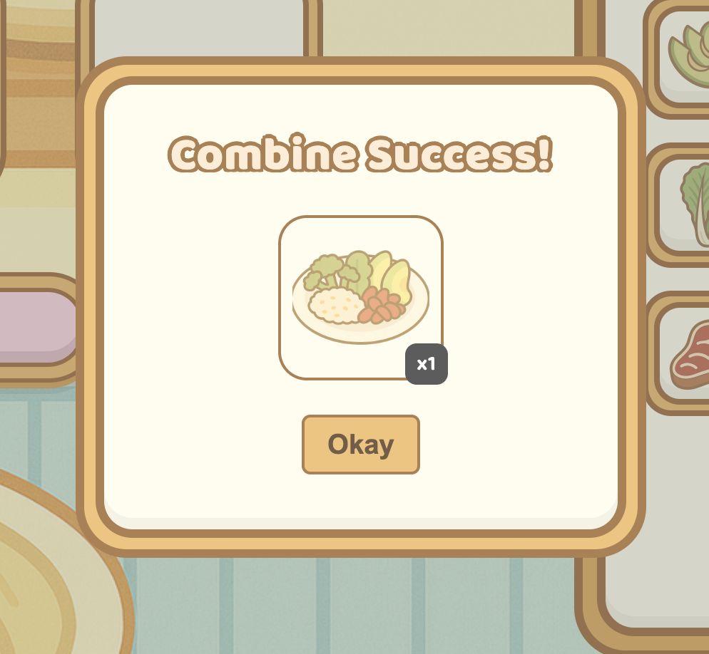
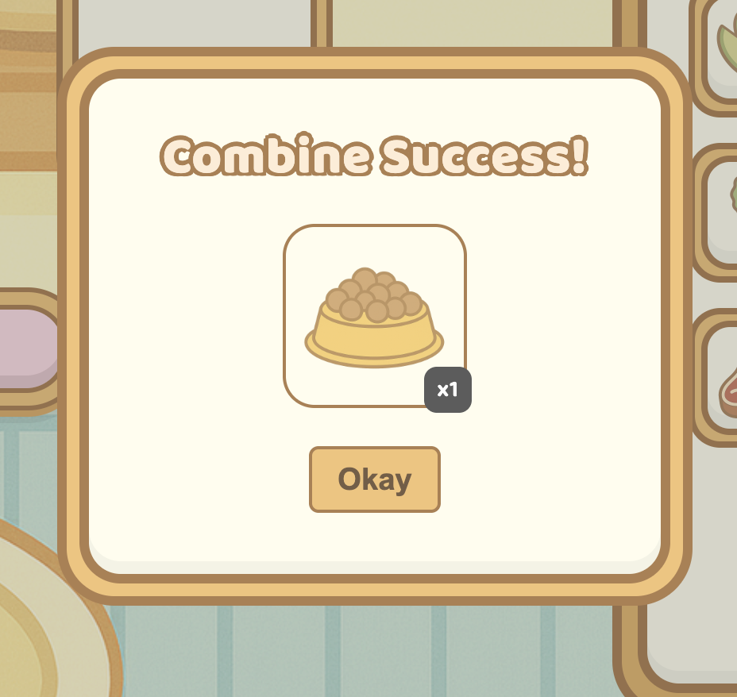

# Pawfect Café

Pawfect Café is a full-stack app where you get to run your own virtual café for pets. Collect ingredients, combine them into recipes, and serve them up to furry friends. Every action earns you hearts and coins, which you can use to keep experimenting. Build recipes, manage your pantry, and keep your café thriving all while unlocking fun rewards.

## Features

- **Inventory System**: Collect and manage raw ingredients
- **Kitchen**: Combine ingredients into new recipes
- **Menu**: Serve crafted dishes to pets and earn rewards
- **Scoring**: Hearts and coins update in real time as you play
- **Admin Panel**: Admin-only tools for adjusting user scores
- **Authentication**: Secure login with JWT (access + refresh tokens)
- **Persistence**: User data (recipes, scores, inventory) saved in PostgreSQL

## Gameplay Flow

Before we start, here's a tiny tip for navigation:

- Coffecup goes to Cafe
- Utensils goes to Kitchen
- Memo goes to Shop
- Gear goes to Settings

### Meet the paws

Feed as many pets as you can and discover all the adorable friends waiting for you!

### Start the cafe day

1. Start by stocking up on ingredients in your Inventory.
   
2. Head over to the Kitchen, where you can add ingredients into slots. You’ll need at least two to make something tasty.  
   
   > Pro tip: Not all foods require 3 ingredients!
3. Click **Combine** and voilà! Your new dish is ready to serve! It’s automatically added to your Menu.
   
   Fret not if your combo doesn't make something on the menu, you'll still receive a bowl of kibbles!
   
   > Tip: Make something available on the menu to gain more points when serving them!
4. Once you have successfully made a dish, don't forget to log it down in your recipes page!
   
5. Feed pets from the menu to earn hearts ❤️ and coins 🪙. Stats update immediately in your café banner so you always know how well you’re doing.
   
   No matter what you feed the pets, they will always love you back!
   
   > Pro tip: Feed what they asked for to gain more points!
6. Admins get a special **Admin Panel** tab where they can select users and grant bonus points (because sometimes café managers need a little help 😉).
   

## Tech Stack

- **React / JavaScript**: Core frontend framework (with Vite for dev/build)
- **CSS Modules**: Scoped component styling
- **React Query (@tanstack/react-query)**: Data fetching + cache management
- **Context API**: Global state for auth and scores
- **jwt-decode**: Extract role permissions from tokens
- **Flask / Python**: Backend API and authentication
- **Flask-JWT-Extended**: Access + refresh token management
- **PostgreSQL**: Relational database for users, recipes, and scores

## Hierarchy & ERD

## Environment Variables

### Frontend

| Variable      | Description                   | Example                 |
| ------------- | ----------------------------- | ----------------------- |
| `VITE_SERVER` | URL of the backend server API | `http://localhost:5000` |

### Backend

| Variable         | Description                       | Example               |
| ---------------- | --------------------------------- | --------------------- |
| `DB`             | Database name                     | `my_database`         |
| `DB_HOST`        | Database host address             | `localhost`           |
| `DB_PASSWORD`    | Database user password            | `supersecret`         |
| `DB_PORT`        | Database connection port          | `5432`                |
| `DB_USER`        | Database username                 | `postgres`            |
| `JWT_SECRET_KEY` | Secret key for JWT authentication | `your_jwt_secret_key` |

## ⚠️ Disclaimer

This project is purely for educational purposes. Hearts, coins, and recipes are fictional and don’t represent real-world nutrition for pets. Please don’t feed your pets café dishes 🍰.

## Author

**Madeline Lim**

Built with coffee, late-night debugging, and plenty of “why is my token not refreshing?!” moments.

Fork it, explore it, and maybe add your own recipes. Extra points if you draw your own kibble icons 🐕.
